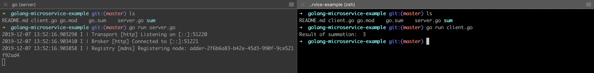

# Pre-requites
1. Install protoc-gen-micro `go get github.com/micro/protoc-gen-micro`  
2. Install Go's support for protocol buffers `go get -u github.com/golang/protobuf/protoc-gen-go`  
3. [Install protocol buffer compiler](https://github.com/protocolbuffers/protobuf)  
4. [Install Go](https://golang.org/doc/install)  

# Steps for writing own microservice
1. Write the API documentation in the protobuf as shown in sum/sum.proto
2. Compile it using `protoc --proto_path=$GOPATH/src:. --micro_out=. --go_out=. sum.proto` . 
3. Implement both server and client, you can look at the example in the repo.
4. Run both the client and server in separate terminals, but server first. 

# How to run this example
Open two terminals, run server first in one terminal, then client in the other one. You're done! 

